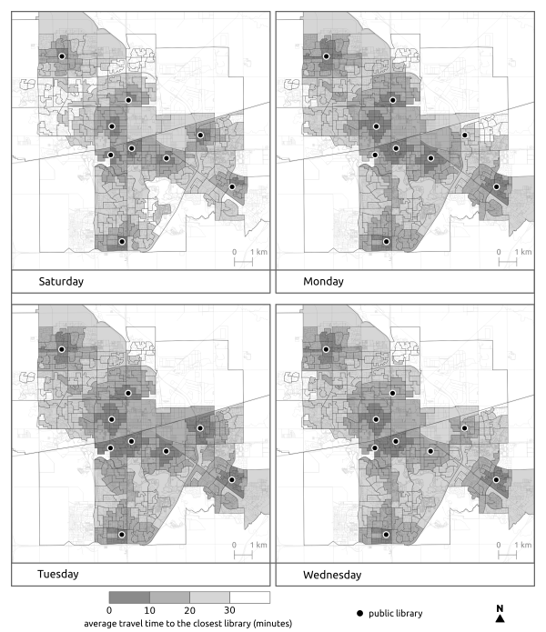

## Mapping Access to Libraries

This repo contains some code which computes the minimum travel time to reach a public library from different locations in a city, and for different times of day.

This requires three data inputs.

1. The coordinates of the libraries and their opening hours.
2. Travel time matrices (for one or multiple modes of travel)
3. Coordinates for locations in which we want to evaluate (these can be addresses, centroids of census zones, etc.)

For (2), travel time matrices can be generated through a number of routing software (OpenTripPlanner, OSRM, pgRouting). For details on creating travel time matrices this with OpenTripPlanner, you can check out this [repo](https://github.com/SAUSy-Lab/OpenTripPlanner_analysis)

The code in `Tmin.R` and `Tmin_transit.R` uses data from (1) and (2) to compute the average travel time from each location in a list, to a set of libraries in a city. This is parameterized for different times of day, or days of the week. It's set up to loop over a set of travel time matrices for different departure times. `Tmin_transit.R` is an extension which accounts for travel time matrices for multiple times of day (due to flucuationg transit schedules).

The code in `Ai.R` computes the average minimum travel time from the data generated in `Tmin.R` for a set time period (e.g. from 10am to 2pm) and for specified travel modes.

Here's an example of the output comparing access to public libraries for different days of the week in Regina, Canada.

